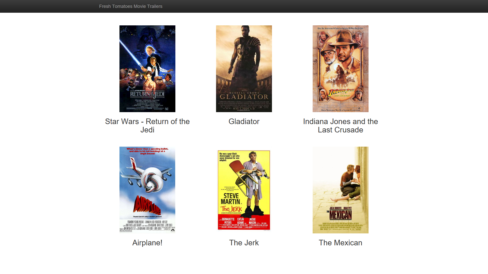

Udacity Full Stack Web Developer Nanodegree

Project 1 - Movie Trailer Website

Chris Gidden, 2018-10-08

<h4>DESCRIPTION</h4>

This is a simple set of code that, when executed, displays a simple web page
displaying movie titles and posters of six movies. A user can click on a movie's
poster to launch its official Youtube trailer.

<h4>CONTENTS</h4>

entertainment_center.py - Main module from which to run program

media.py - Implementation of Movie class

fresh_tomatoes.py - Udacity-supplied helper file used to create and display 
			    program components on movie web page

<h4>SETUP</h4>

Clone this repository and navigate to its landing directory.
	
 
<h4>HOW TO RUN</h4>

From IDLE or a Windows command prompt, run the entertainment_center.py file.

Run entertainment_center.py

	$ cd (landing directory)
	$ python entertainment_center.py

